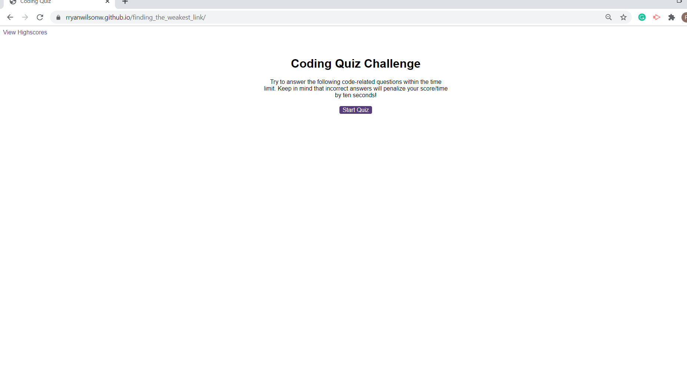

# Finding_the_weakest_link #
In this program the user is presented with a quiz to test their knowledge of computer programming. When the user loads up the page, they are presented with a start screen. When the user presses the start button, they are presented with a series of questions to test their knowledge. When the user picks a wrong answer, 10 seconds will be subtracted from the timer and incorrect will render onto the screen. When the user picks the correct answer, the next question will appear and correct will render on the screen. If the user runs out of time, the game will end sending you to the submit screen. If the user selects the finale correct answer, the game will end taking you to the submit screen. The submit screen is a page where the user can get their final score, and submit it along with their initials. The users final score is equal to the amount of seconds left at the end of the game. The top 5 finale scores will then render in the highscores page. After the user hits submit, they will be taken to the highscores page where they can see how their score compares to others. From the high score page, you can hit the back button to restart the game and try again. 

# Link_to_website. #
<a href="https://rryanwilsonw.github.io/finding_the_weakest_link/">Quiz game</a>
# Image_of_website. #

